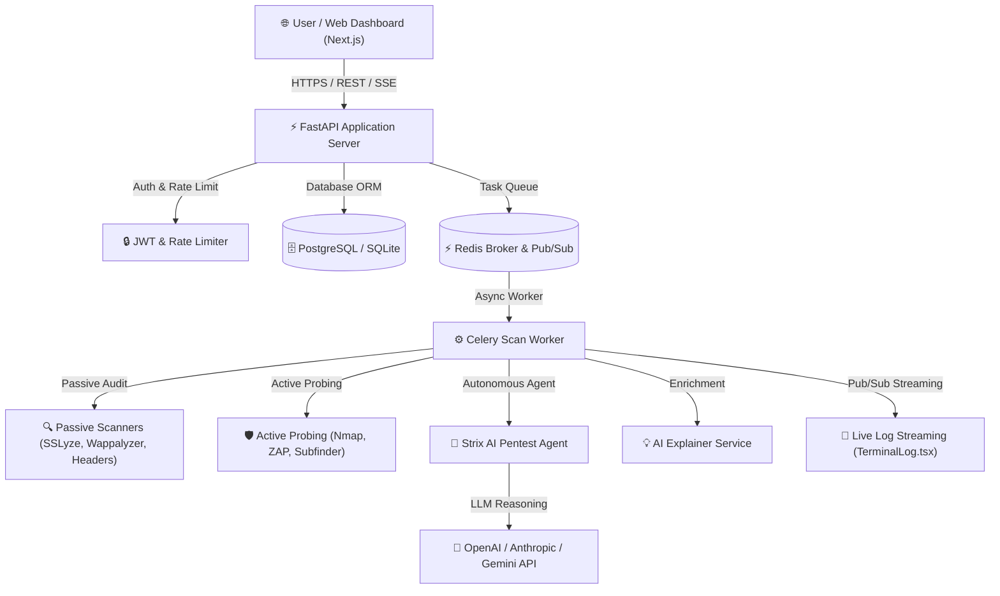

# CyberGuardian AI 🛡️🤖
### AI-Powered Web Application Security & Autonomous Penetration Testing Platform

CyberGuardian AI is a production-grade, multi-tenant web security audit and autonomous penetration testing platform. It combines automated passive reconnaissance, active vulnerability scanning, bug bounty program management, and autonomous AI penetration testing powered by **Strix AI** (`usestrix/strix`).

---

## 🌟 Key Features

- **🤖 Strix AI Autonomous Pentest Engine**: Leverages multi-agent LLM reasoning to perform autonomous vulnerability discovery, real exploit validation (PoC generation), OWASP Top 10 analysis, and auto-generated fix patches.
- **⚡ Multi-Mode Security Scanning**:
  - **Vulnerability Scan**: Passive checks (SSL/TLS certificates, security headers, technology fingerprinting, robots/sitemap exposures, third-party JS scripts).
  - **Full Pentest**: Active probing (Nmap service ports, OWASP ZAP API alerts, directory fuzzing, subdomain discovery).
  - **Strix AI Pentest**: Autonomous agentic security assessment on verified targets.
- **🧠 AI Finding Explainer & Remediation**: Automatically enriches raw security findings with executive summaries, CVSS 3.1 scores, OWASP Top 10 categories, MITRE ATT&CK tactics, and step-by-step code remediation.
- **🛡️ Bug Bounty & Security Researcher Portal**: Program creation, scope management (in-scope/out-of-scope targets), reward tier rules, researcher reputation scoring, and vulnerability report triage workflows.
- **📊 Compliance Mapping & Trust Badges**: Real SOC 2 / ISO 27001 / India DPDP Act compliance control coverage calculation, scan drift tracking over time, and embeddable public SVG trust badges (Grade A-F).
- **🔒 Enterprise Multi-Tenant Security**: Tenant isolation (`org_id` boundaries), Redis-backed rate limiting, log redaction filters, and immutable audit logging.

---

## 🏗️ System Architecture



---

## 🚀 Responsible Use & Ethics Policy

> [!IMPORTANT]
> **STRICT AUTHORIZATION GATE REQUIREMENT**:
> CyberGuardian AI performs real automated scanning and autonomous exploitation testing. This platform is designed exclusively for authorized security assessments on assets **owned or explicitly authorized** by the user.
> 
> - **Ownership Verification**: Active probing and Strix AI penetration tests are strictly gated by domain ownership verification (DNS TXT record or HTTP challenge file).
> - **No Unauthorized Probing**: Attempting to scan or exploit unauthorized targets is strictly prohibited and violates terms of service.
> - **Human Review Checkpoint**: Auto-generated remediation patches provided by Strix AI require mandatory manual review and approval by a security engineer before merging into production.

---

## 💻 Tech Stack & Rationale

| Layer | Technology | Rationale |
| :--- | :--- | :--- |
| **Frontend UI** | Next.js 16 (App Router), React 19, TypeScript, Tailwind CSS | High-performance server/client rendering, responsive modern UX, type safety |
| **Backend API** | FastAPI (Python 3.12), Pydantic v2 | Asynchronous high-throughput REST API with automatic OpenAPI validation |
| **Database** | SQLAlchemy ORM, SQLite / PostgreSQL | Robust relational data modeling with multi-tenant `org_id` isolation |
| **Task Queue** | Celery + Redis | Decoupled asynchronous background execution for long-running security scans |
| **AI Agents** | Strix AI Engine, OpenAI / Anthropic / Gemini APIs | Multi-agent autonomous reasoning for exploit validation and PoC confirmation |

---

## ⚙️ Quickstart & Local Setup

### 1. Backend Setup
```bash
cd backend
python -m venv .venv
# On Windows:
.venv\Scripts\activate
# On Linux/macOS:
source .venv/bin/activate

pip install -r requirements.txt
copy .env.example .env

# Run FastAPI dev server:
python -m uvicorn app.main:app --host 0.0.0.0 --port 8000
```

### 2. Frontend Setup
```bash
cd frontend
npm install
npm run dev
```

### 3. Open Application
- **Frontend Dashboard**: [http://localhost:3000](http://localhost:3000)
- **Interactive Swagger API Docs**: [http://localhost:8000/docs](http://localhost:8000/docs)

---

## ⚠️ Known Limitations

- Automated vulnerability scanning and AI agent pentesting provide high-coverage feedback loops but are not a complete substitute for manual human penetration testing.
- Strix AI autofix patches are advisory and require human code review prior to production deployment.
